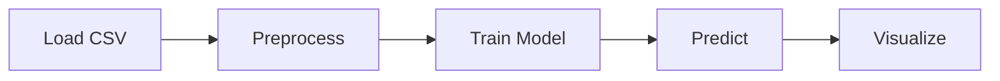

# Gasoline Price Prediction

This repository provides a simple Python project that demonstrates how to predict gasoline prices using historical data.  
It includes data loading, preprocessing, a linear regression model, and basic visualizations.

## Project Overview

The pipeline consists of four main steps:

1. **Load** historical price data from a CSV file.
2. **Preprocess** the data (date parsing, missing‑value handling, feature engineering).
3. **Train** a regression model (`LinearRegression`) on the processed data.
4. **Predict** future prices and visualize the results.

## Directory Structure

```
├── src/                     # Source code
│   ├── data_processing.py   # Load & preprocess utilities
│   ├── model.py             # Model training & prediction
│   ├── visualization.py     # Plotting helpers
│   └── predict.py           # End‑to‑end script tying everything together
├── data/                    # Example data files (add your CSVs here)
│   └── .gitkeep
├── notebooks/               # Jupyter notebooks for exploration
│   └── .gitkeep
├── tests/                   # Placeholder for unit tests
│   └── .gitkeep
├── docs/                    # Documentation assets
│   └── .gitkeep
├── requirements.txt         # Python dependencies
├── .gitignore               # Files/folders ignored by Git
└── README.md                # This file
```

## Setup

1. **Clone the repository** (already done if you are in the workspace).
2. **Create a virtual environment** (optional but recommended):

   ```sh
   python3 -m venv venv
   source venv/bin/activate
   ```

3. **Install dependencies**:

   ```sh
   pip install -r requirements.txt
   ```

## Usage

Run the end‑to‑end prediction script:

```sh
python -m src.predict
```

Edit `src/predict.py` to point `csv_file` to your own CSV file located in the `data/` folder.

The script will:

- Load the data (`src/data_processing.load_data`)
- Preprocess it (`src/data_processing.preprocess`)
- Train a linear regression model (`src/model.train_model`)
- Generate predictions (`src/model.predict`)
- Plot the historical series and the actual vs. predicted values (`src.visualization`)

## Pipeline Diagram



## Extending the Project

- Replace the linear regression model with more advanced algorithms (e.g., RandomForest, XGBoost, or a neural network).
- Add more sophisticated feature engineering (rolling averages, seasonal indicators, etc.).
- Write unit tests under `tests/` to ensure data processing and model functions work as expected.
- Create Jupyter notebooks in `notebooks/` for interactive experimentation.

---

*Happy coding!*